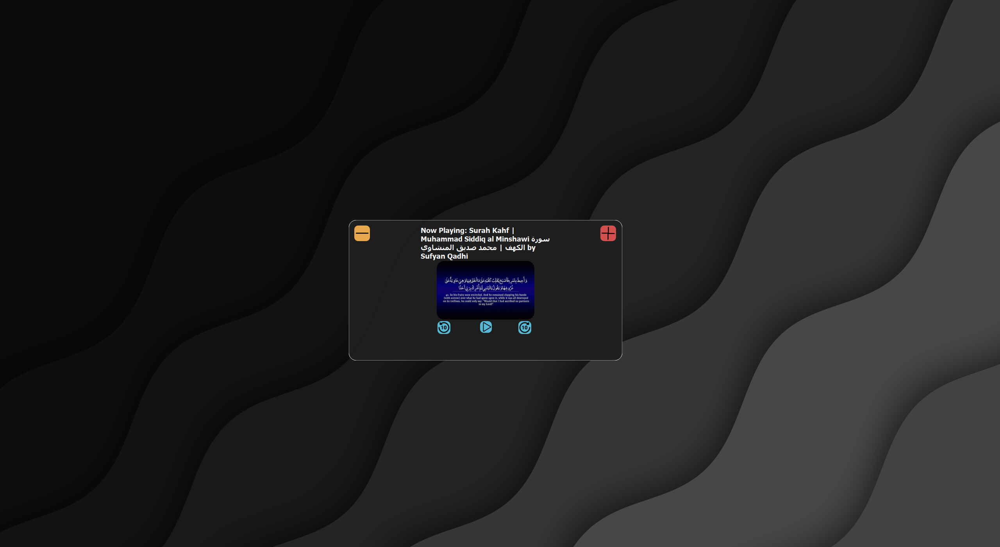
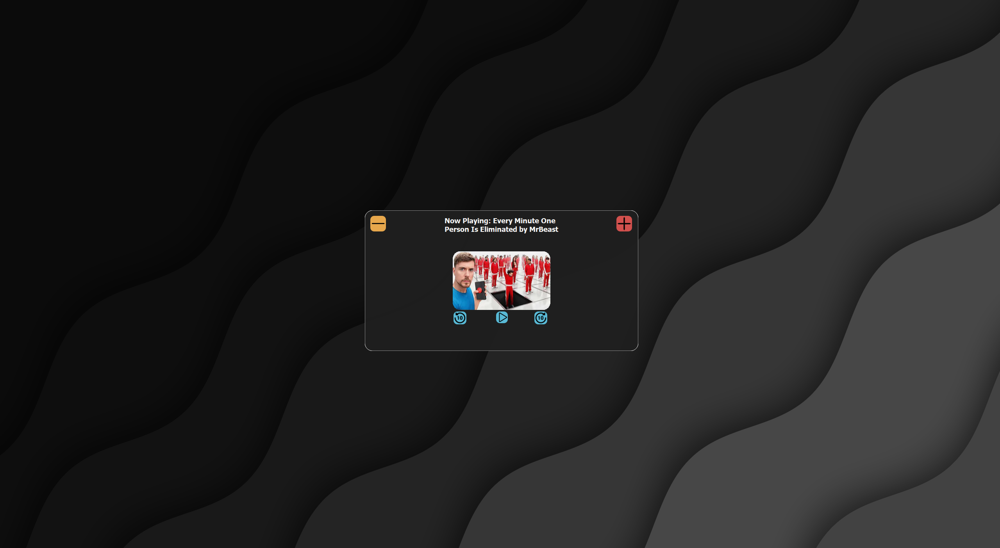

## ENGLISH

# 📺 RaM-MediaX

A sleek, modern, and lightweight media player built with Python, PyQt and Windows API. RaM-MediaX offers a minimalist interface with powerful playback features, optimized for both performance and ease of use.

## 🚀 Features

- 🎵 **Play/Pause, Forward, Rewind**
- 📂 **Supports Popular Media Formats** (MP3, MP4, WAV, AVI, etc.)
- 🔲 **Minimalistic & Modern UI** with custom QSS styling
- ⚡ **Lightweight & Fast Performance**

## 🖼️ Screenshots




## 🛠️ Installation

1. **Clone the repository:**
   ```bash
   git clone https://github.com/naturalcapsule/RaM-MediaX.git
   cd RaM-MediaX
   ```

2. **Install dependencies:**
   ```bash
   pip install -r requirements.txt
   ```

3. **Run the application:**
   ```bash
   python media.py
   ```

## 📦 Dependencies

- **Python 3.9**
- **PyQt5**
- **asyncio**
- **winrt**

## ⚙️ Configuration

Customize colors and themes in `config.conf` to match your preferences.

## 🤝 Contributing

Contributions are welcome! Feel free to fork the repository, submit pull requests, or open issues.

1. Fork this repository
2. Create a new branch (`git checkout -b feature-branch`)
3. Make your changes
4. Commit your changes (`git commit -m 'Add new feature'`)
5. Push to the branch (`git push origin feature-branch`)
6. Open a Pull Request

Made with ❤️ by [Natural Capsule](https://github.com/naturalcapsule)


## KURDISH SORANI

# 📺 RaM-MediaX

RaM-MediaX پێلەری میدیایەکی سەرهەڵدەر، نوێنەر، و سووکە کە بە Python، PyQt و Windows API دروستکراوە. ئەم بەرنامەیە ڕووکارییەکی کەمترین و بەکارھێنانی بەهێز پێشکەش دەکات، چاکسازکراو بۆ بەرهەمھێنانی بەرز و ئاسانکارییەکانی بەکارهێنەر.

## 🚀 تایبەتمەندییەکان

- 🎵 **یاری/وەستاندن، پێشچوون، و گەڕانەوە**
- 📂 **پاڵپشتی لە شێوە فایلی میدیای باوەڕپێکراوەکان** (MP3، MP4، WAV، AVI، و هتد)
- 🔲 **ڕووکارییەکی کەمترین و نوێنەر** بە ڕووکاری تایبەتی QSS
- ⚡ **کاریگەرییەکی بەرز و پێشکەوتوو**

## 🖼️ وێنەکان


## 🛠️ دامەزراندن

1. **فۆرکی پڕۆژەکە بکە:**
   ```bash
   git clone https://github.com/naturalcapsule/RaM-MediaX.git
   cd RaM-MediaX
   ```

2. **پێویستەکان دامەزرێنە:**
   ```bash
   pip install -r requirements.txt
   ```

3. **بەرنامەکە بەڕێوەبەرە:**
   ```bash
   python media.py
   ```

## 📦 پێویستەکان

- **Python 3.9**
- **PyQt5**
- **asyncio**
- **winrt**

## ⚙️ ڕێکخستن

دەکرێت ڕەنگ و تێماکان لە `config.conf` گۆڕدرێن بۆ گونجاوکردن بە سەرقاڵی خۆت.

## 🤝 بەشداریکردن

بەشداریکردن بەخێربایە! دەتوانیت فۆرکی پڕۆژەکە بکەیت، داواکاریی پێکەوەکردن بەنێریت، یان کێشەیەکان بکەیتەوە.

1. فۆرکی ئەم پڕۆژە بکە
2. برانچێکی نوێ دروست بکە (`git checkout -b feature-branch`)
3. گۆڕانکارییەکانت بکە
4. گۆڕانکارییەکانت تۆمار بکە (`git commit -m 'Add new feature'`)
5. بۆ برانچەکە ڕادەستی بکە (`git push origin feature-branch`)
6. داواکاریی پێکەوەکردن بکە

دروستکراوە بە ❤️ لەلایەن [Natural Capsule](https://github.com/naturalcapsule)

